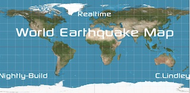

# About
This is a Earthquake Map Display for Raspberrypi bullseye and Attached screen. you can download *alpha* not currently its own repository till more testing done

This fork adds additoional features
- command line output
- working clock
- fullscreen mode
- interactive you can now escape out
- more features soon... open issues/requests

# Installation
```shell
sudo apt-get install python3-pip python3-dev
sudo pip3 install pygame
cd ~
git clone
python3 EQMap.py
```

#### Steps to disable Screen Blanking or Sleeping with the Raspberry Pi

1. In Raspberry Pi Configuration Window, click on Display Tab.
1. Look for the Screen Blanking row, click Disable . Then click OK .
1. A window will open and asks if you like to reboot the Raspberry Pi. Click Yes .
1. Raspberry Pi will reboot.


## Hardware:
### Tested
* Raspberry Pi3
* https://www.amazon.com/ElecLab-Raspberry-Touchscreen-Monitor-Capacitive/dp/B08LVC4KRM/
  * works nice with a offical raspberry pi4/usb-c power supply at 3A and pi3

### Untested:
* Raspberry Pi4,Pico
* https://www.amazon.com/Eviciv-Portable-Monitor-Display-1024X600/dp/B07L6WT77H/

## EQMap Source 
* http://craigandheather.net/celeearthquakemap.html
  * EQMap orginal project in doc/src directory by Craig A. Lindley 2021

## To-Do
- add RSS/moon/sun/tide
- use memory to lower any disk write
- settings menu for UTC and sleep