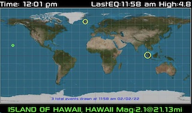

# About
This is a Earthquake Map Display for Raspberrypi Attached screen

This fork adds additoional features
- command line output
- working clock
- fullscreen mode, escape or q to exit
- new data base display methods!
- more features soon... open issues/requests

# Installation
```shell
sudo apt-get install python3-pip python3-dev
sudo pip3 install pygame
cd ~
git clone
python3 EQMap.py
```
## Hardware:
### Tested
* Raspberry Pi3
* https://www.amazon.com/ElecLab-Raspberry-Touchscreen-Monitor-Capacitive/dp/B08LVC4KRM/
  * works nice with a offical raspberry pi4/usb-c power supply at 3A and pi3

### Untested:
* Raspberry Pi4,Pico
* https://www.amazon.com/Eviciv-Portable-Monitor-Display-1024X600/dp/B07L6WT77H/

## EQMap Source 
* http://craigandheather.net/celeearthquakemap.html
  * EQMap orginal project in doc/src directory by Craig A. Lindley 2021

## To-Do
- add RSS/moon/sun/tide
- use memory to lower any disk write
- settings menu for UTC and sleep