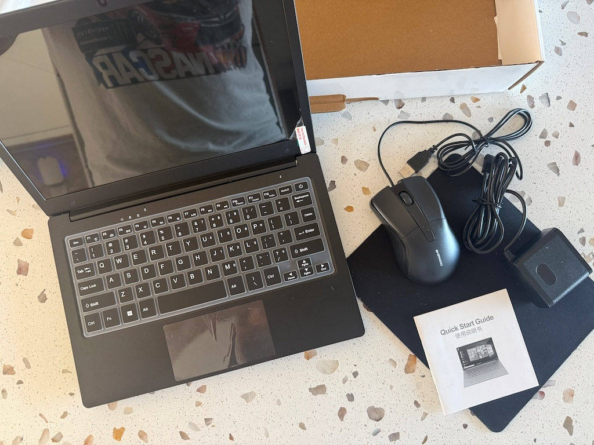
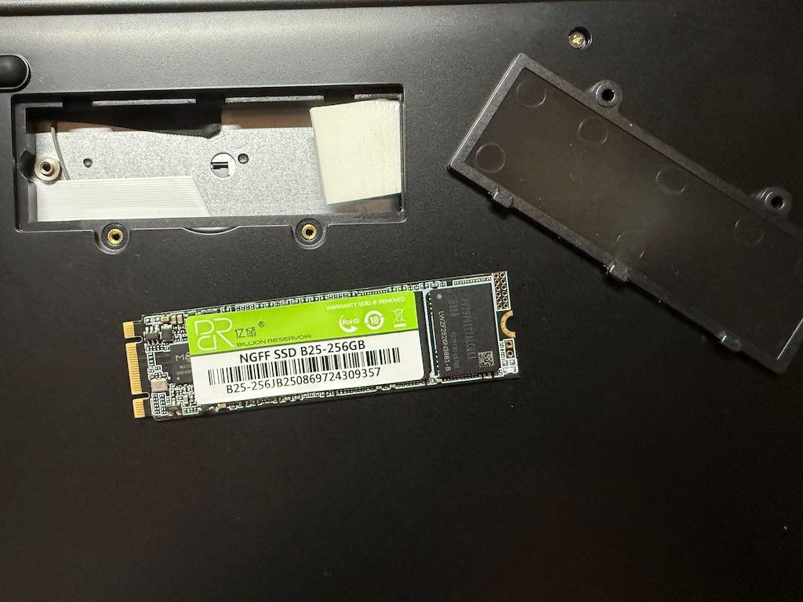
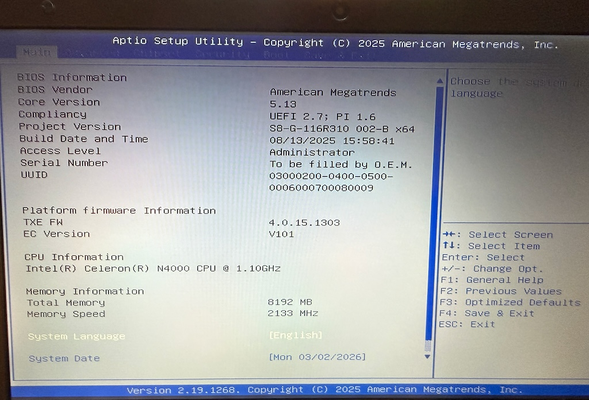
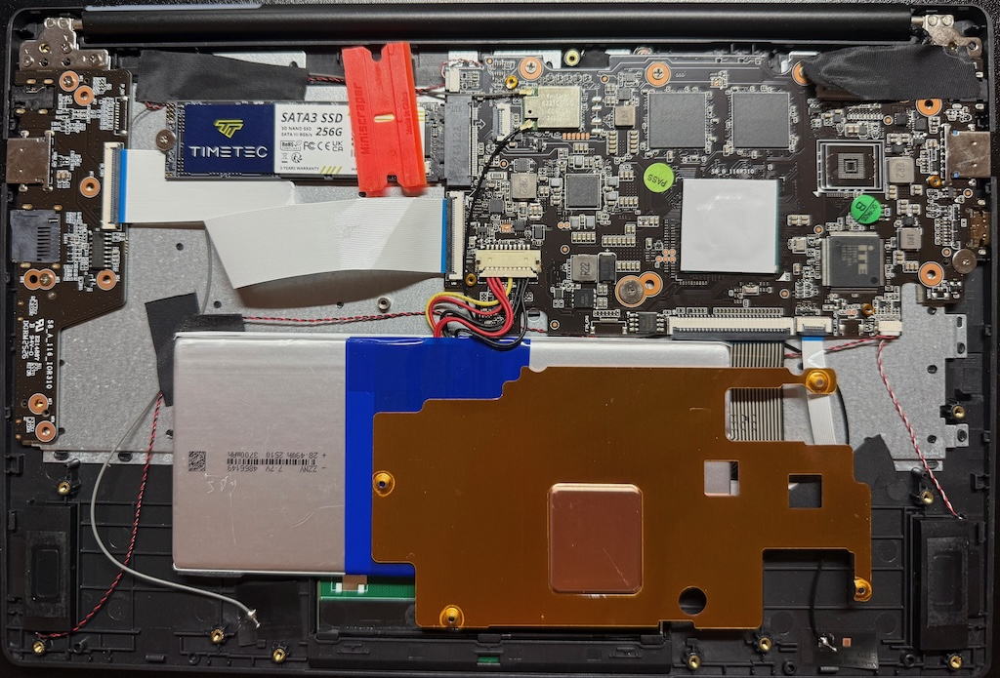
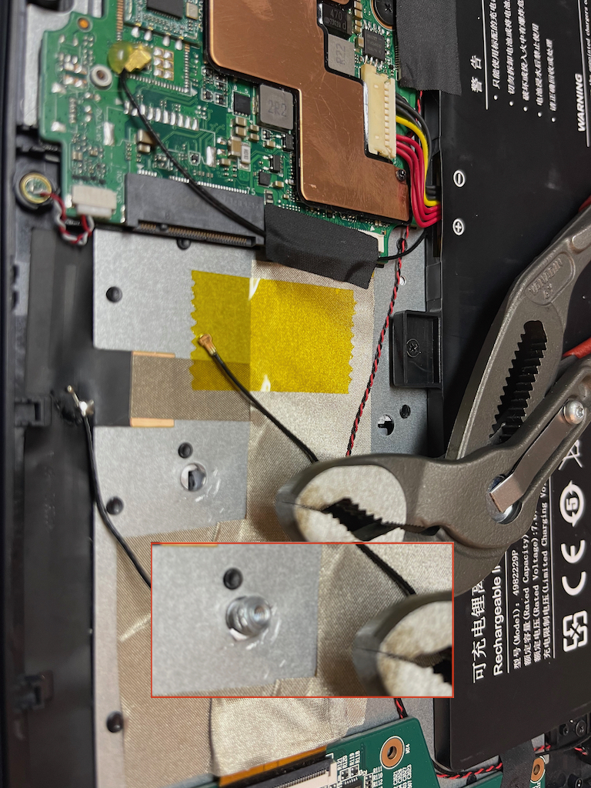
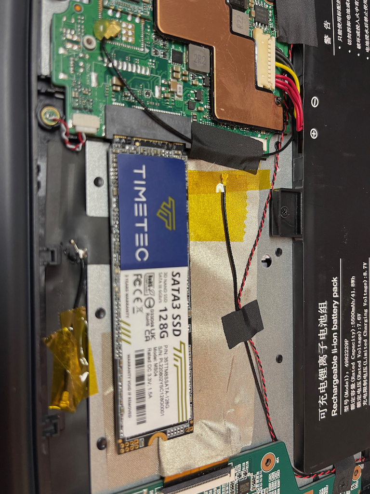
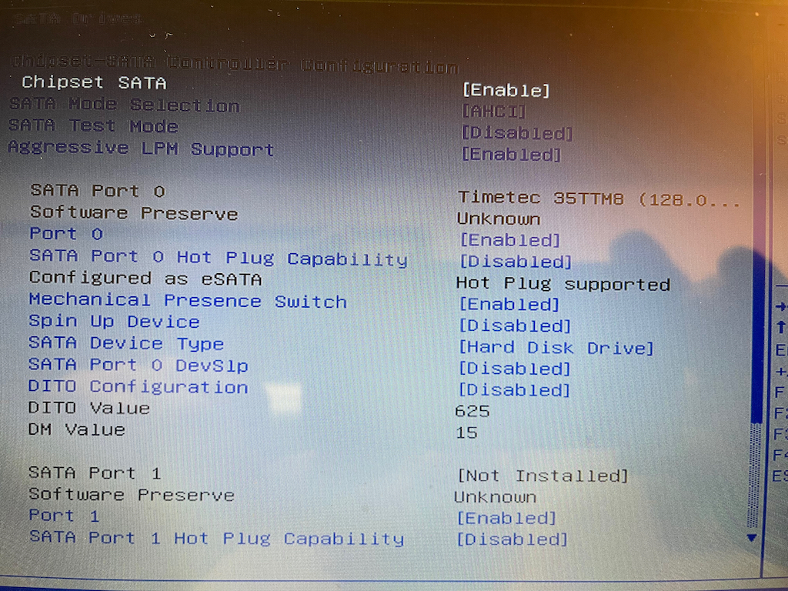
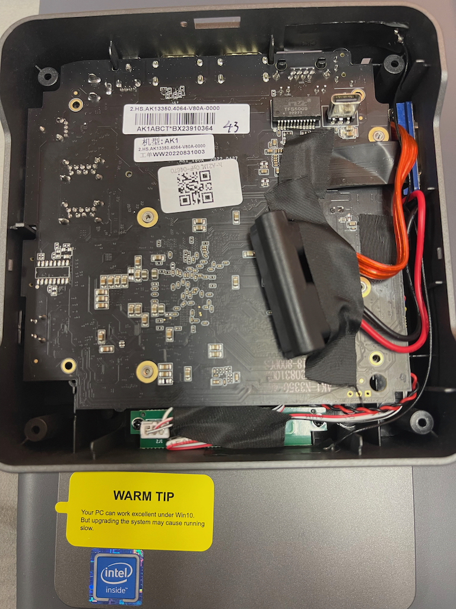
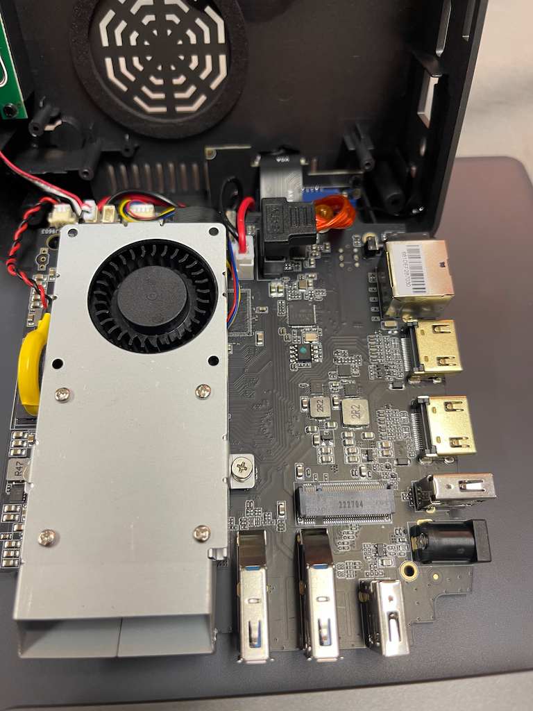

# Cheap hardware notes

## evolve 4
- X004IH4XEL
  - PONKLOIE Laptop 11.6" Laptop Travel Laptops, Black New Made In China
  - N4000 Dual1GhzCore intel 8GB RAM 256SATA
  - $50-170 (shipped Q1 2026 Amazon)
  - shipped with windows 11
  - has much improved screen and Keyboard is much better!

comes with all shown.
keyboard has a overlay protector which just flops on top

I found the included power wart might be garbage and not provide current well.

now with access port and cheap drive.. 
had some disk i/o issues and re-seating it might have helped performance.

still looks sus has a TPM chip?
a lot of heat throttling was shut off
also it seems to use 2GB ram for system video?

Shows the lack of any real heat managment for the CPU

### Issues had to resolve with OEM hardware
Installed a new SATA (same brand as used in e3 below) Things seem more stable for install of a new OS this go round. The issue might be the cheap loking storage chip. Had many issues with hardware locking and other random i/o errors. Things seem much better and stable after replacing the SATA.

fixed stability for a bit but heat related stability seems back after a few hours of use.

## evolve 3
A classic, well loved and still kicking after all these years Linux Mint supporting all hardware now.

- windows is likely stolen copy no authenticity anywhere and sickers to not upgrade
- eMMC storage needs upgraded ideally (very slow)
- open them up fingerprints and hot glue so know your build quality
  - I have opened this a few times and one screw mount has broken out of the plastic
- track pad function in Linux
  - I2C issues
- the last and bigger issue you will get a random v1 or v2 hardware

- v1 stuff works mostly v2 the sound card is hacked up and won’t work from what Lots say 
  - sounds like also a “v3” is out there as well. 
- no drivers no bios no wifi drivers included in any official packages it smells like and lots of unstable wifi complains
  - supply chain security issues all over this

### SATA installation on v1 hardware

for 80mm cards pull this stud

pull the battery header off mainboard before you do this

put the cheapest amazon SD card (under $14) into the cheap laptop

the screen refresh reminds me of CRT display days!

## ouvislite mini pc

- same as the laptop, N3350 cpu
- can take SATA
- upgrade system, will cause slow

