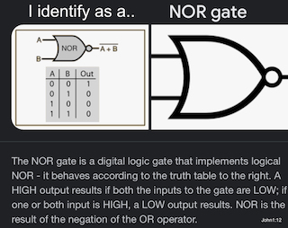

This is a landing ground for various projects from KellyKeeton.com aka Kelly Keeton aka K7MHI.

I would not recomend cloning this repro, rather select from below.

## Currently active: 

Working on a port of [Pi-Build](https://github.com/SpudGunMan/pi-build/tree/alpha) project I am calling [bapi](https://github.com/SpudGunMan/bapi)

Set your Grid while in the field with gpsd
- https://github.com/SpudGunMan/gpsd2ham
- https://github.com/SpudGunMan/SpudGunMan/tree/main/pota-scripts
  - Park Activation Helper

## Archive or back burner
- https://github.com/SpudGunMan/SpudGunMan/tree/main/N3450-devices
- https://github.com/SpudGunMan/SpudGunMan/tree/main/quadra
- https://github.com/SpudGunMan/EPIC-PWRgate-mods
- https://github.com/SpudGunMan/TT4-mods
- https://github.com/SpudGunMan/Micro-TrakRTGFA-mods
- https://github.com/SpudGunMan/MicroTrak-MTT4B-mods
- [SteppIR](https://github.com/SpudGunMan/steppir-mods) Mods
- [Arcade](/arcade/README.md) projects folder
- [Lego](Lego/README.md) projects folder
- [EarthQuakeMap2](https://github.com/SpudGunMan/EQMap2) Earthquake Map for raspPi