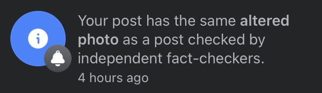

This is a landing ground for various projects from KellyKeeton.com I would not recomend cloning this repro, rather select from below.

## Currently active: 

Micro-Trak APRS
- https://github.com/SpudGunMan/Micro-TrakRTGFA-mods
- https://github.com/SpudGunMan/MicroTrak-MTT4B-mods

Working on a port of this project I am calling [bapi](https://github.com/SpudGunMan/bapi)
- Fork of this project [Pi-Build](https://github.com/SpudGunMan/pi-build/tree/alpha)
- https://github.com/SpudGunMan/SpudGunMan/tree/main/N3450-devices
- https://github.com/SpudGunMan/SpudGunMan/tree/main/quadra

## Archive or back burner
- [Arcade](/arcade/README.md) projects folder
- [Lego](Lego/README.md) projects folder
- [EarthQuakeMap2](https://github.com/SpudGunMan/EQMap2) Earthquake Map for raspPi