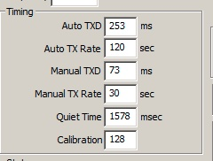
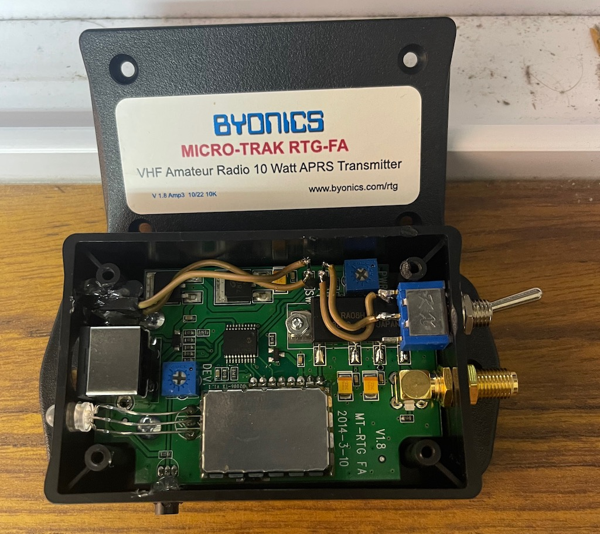
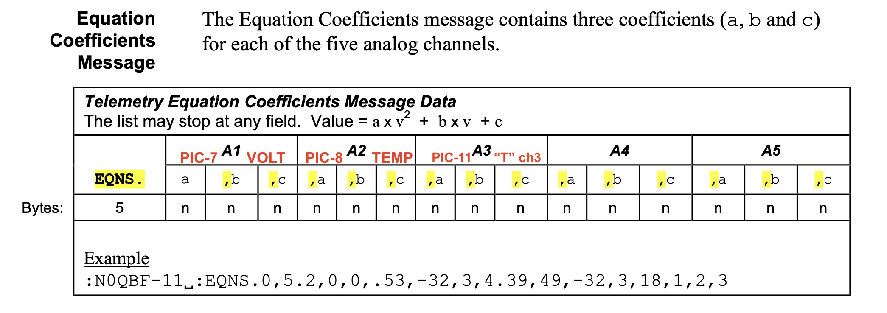

# Micro­Trak RTG FA

The [Manual](MicroTrak_RTG_FA_Manual_v1.8-2.pdf) describes the hardware and firmware functions

The [Config Manual](TinyTrak3_Config_Manual_v1.4.pdf) is also mandatory to review as it has lots of nerdy bits.
A difference my shipped device has the following autoTXD changes as defaults



## Quick Setup

Following is for temp return in F
```
PARM.Battery,Temp
UNIT.Volts,Deg.F
EQNS.0,0.0293,0,0,0.879,-­459.67
```
Following for temp return in C
```
PARM.Battery,Temp
UNIT.Volts,Deg.C
EQNS.0,0.0293,0,0,0.489,-­273.15
```

enter the data into [findu entermsg tool](http://www.findu.com/cgi­bin/entermsg.cgi)
- I have found issues with the EQNS, I cant send it to myself like the manual shows.
  - If using a SSID it works FROM TO cant be the same call possibly?
    - so if your device is programed for N0CALL-4 you want to send from NOCALL-1 
  - if you mess up send the same VAR into the message tool (PARM,UNIT,EQNS)


# Advanced and mods

the “SW” and “T” markings are reversed. “T” is the secondary configuration switch input, and “SW” is the analog telemetry input photo here shows functioning connections to the hardware. jumpers used to extend the telemetry port externally when used.

## backup default device first
 - Recomend a read config, a save config and set that .tt3 file to readonly status. This way you have a safe default copy. 
 - now when changes are made pressing save will ask what to save new file and not your default!

## Software changes

 - UART enable
   - Allow TTL Serial, enable to have easy interface with raspberry pi GPIO or similar.
 - Switch for profiles, make a 2nd one..
 - 3rd Telemetry input
    - make sure to click edit telemetry and you can
    - Set up auto telemetry reporting (aka not use the findu.cgi over the air) by clicking the edit telemetry button
    - Change channels
      - 1 supply voltage, sampled from PIC pin 7
      - 2 LM-335 temp sampled from PIC pin 8
      - 3 "T" PCB pin-header, sampled from PIC pin 11
    - Definition Rate 0 assume is off??

### The Telemetry Definition Text
allows telemetry definitions to be sent regularly to describe and adjust the telemetry reports
    - can we send other data/msg...??

Following is for temp return in F added the additional sensor into battery2 as voltage, this is entered directly into the GUI edit telemetry window. Change my call to the SSID that your profile is using

**before you do any of this, remember that the PIC is 5v and this is a unprotected line**

```
:MYCALL   :PARM.Battery,Temp,Battery2
:MYCALL   :UNIT.Volts,Deg.F,Volts
:MYCALL   :EQNS.0,0.0293,0,0,0.879,-­459.67,0,0.0293
:MYCALL   :BITS.00000000,TinyTrak

```
 - MYCALL is the callsign of the tracker, padded with spaces to length 9. 
 - PARM line give a description of each telemetry channel
 - UNIT line gives a textual unit to describe each channel
 - EQNS line gives a A B, and C for each Analog channel (we have 3) 
   - EQNS. `Ax^2,Bx,C`  **,**  `Ax^2,Bx,C`   **,**  `Ax^2,Bx,C`
   - EQNS. `Volts`  **,**  `Deg`   **,**  `Chan3-Pin11`
 - BITS line describes the digital telemetry (not used **but can we feed into PIC PIN-11**), followed by the project name for the telemetry or operation or kit

### The EQNS voltage `0,0.0293,0` is calculated in the following way. 
- Since the supply voltage is fed through a 10K & 2K voltage divider, the voltage presented to PIC pin 7
  - Input supply voltage (commonly 12v) passes the voltage divider 2K/(10K+2K) or 1/6 `0.0293` the supply voltage. 
  - The PIC analog read value is a number between 0 (for 0 volts) and 1023 resolution (for 5 volts PIC reference).
  - So the supply voltage can be found my multiplying the reported number, by 5V/1023*6 or 0.0293. 
    - Reverse: look at live telemetry data, volt packet might be `442` which 442*0.0293 displays Battery: 12.95v on aprs.fi
  - back to EQNS (Ax^2 + Bx + C). The first 3 numbers in the EQNS:
    - A = 0, B = 0.0293, and C = 0


APRS.org document snip with red text overlay showing this device values.

### The EQNS Temp `0,0.879,-­459.67`F or `0,0.489,-­273.15`C is calculated in the following way.
- The temperature sensor analog-8 reports 10mV / deg K, and deg F = deg K * 9/5 – 459.67
  - LM-355 voltage (5V/1023) / 0.01V multiplied by 9/5 = 0.879 then 459.67 is subtracted
- For Celsius, (deg C == deg K – 273.15) 
  - LM-355 voltage(5V/1023) / 0.01V = 0.489 and then 273.15 is subtracted.


# Reference material
T Packets https://aprs.fi/telemetry/a/N0CALL


## Findu quicklinks for scripting into automation
 - POST into www.findu.com/cgi-bin/sendmsg.cgi?fromcall=N0CALL&tocall=N0CALL&msg=EQNS.0%2C0.0293%2C0%2C0%2C0.879%2C-459.67
 - pre filled form, www.findu.com/cgi-bin/entermsg.cgi?fromcall=N0CALL-9&tocall=N0CALL
 - sniff the db http://www.findu.com/cgi-bin/msg.cgi?call=*

More on EQNS on page 70 Telemetry starts a little back on 68 of the [APRS whitepapers](http://www.aprs.org/doc/APRS101.PDF)

APRS Telemetry [note](http://he.fi/doc/aprs-base91-comment-telemetry.txt) for Base91 and aprs.fi telemetry

[aprs.fi](https://aprs.fi/doc/guide/aprsfi-telemetry.html) telemetry doc

[reference](https://github.com/PhirePhly/aprs_notes/blob/master/telemetry_format.md) on telemetry format


