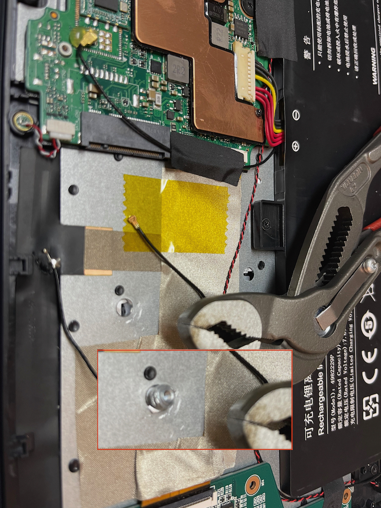
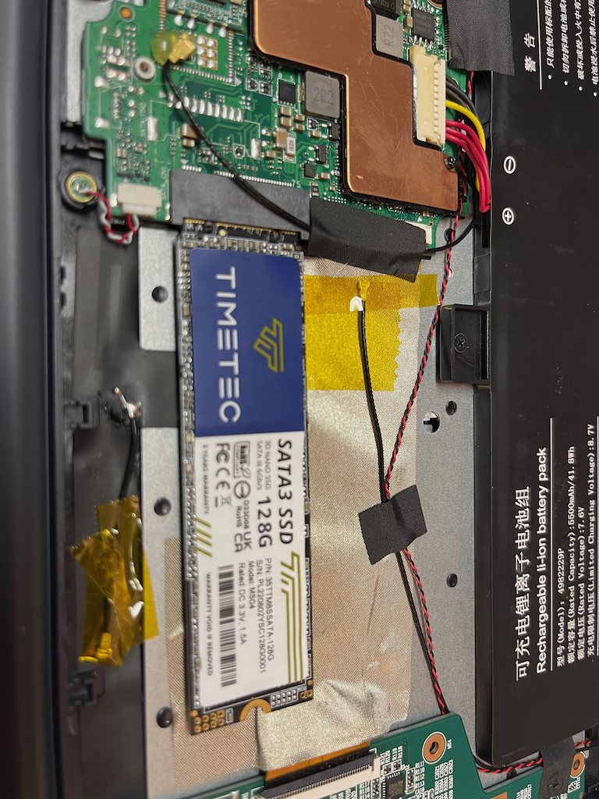
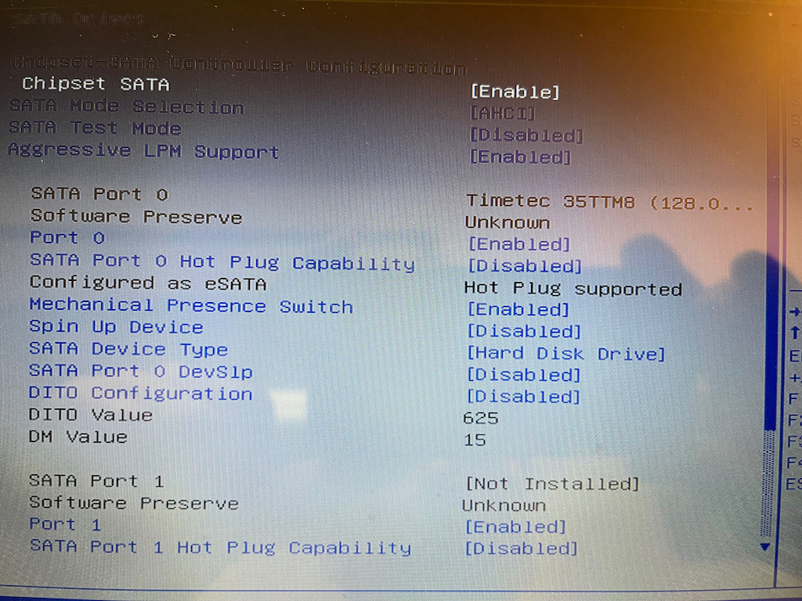
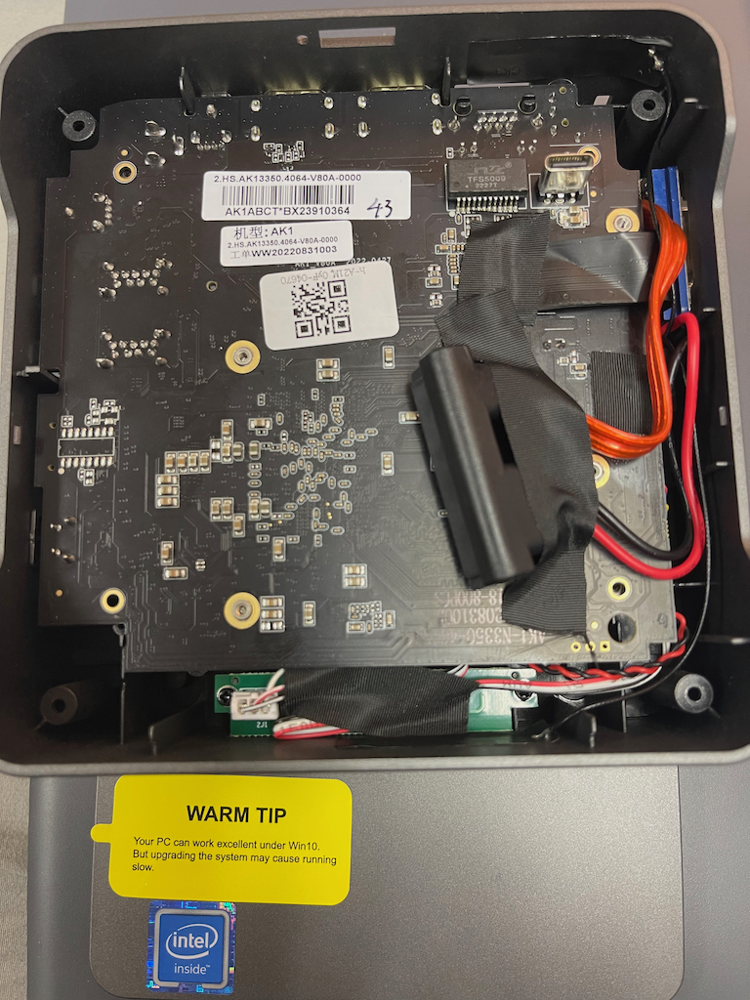
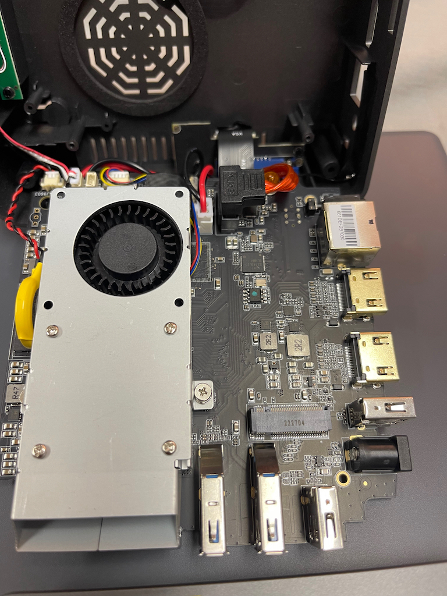

# Cheap hardware notes

## evolve 3

- windows is likely stolen copy no authenticity anywhere and sickers to not upgrade
- eMMC storage needs upgraded ideally (very slow)
- open them up fingerprints and hot glue so know your build quality
  - I have opened this a few times and one screw mount has broken out of the plastic
- track pad function in Linux
  - I2C issues
- the last and bigger issue you will get a random v1 or v2 hardware

v1 stuff works mostly v2 the sound card is hacked up and won’t work from what Lots say 

sounds like also a “v3” is out there as well. 

no drivers no bios no wifi drivers included in any official packages it smells like and lots of unstable wifi complains 

### SATA installation on v1 hardware

the screen refresh reminds me of CRT display days!

## ouvislite mini pc

- same as the laptop, N3350 cpu
- can take SATA

