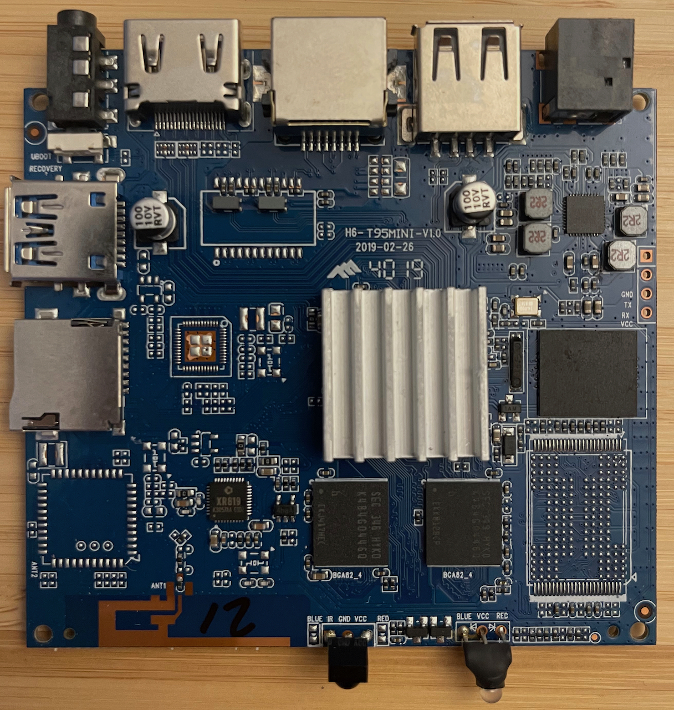

https://www.inovato.com

 - app loader https://github.com/Botspot/pi-apps
 - quick start https://forum.inovato.com/getting-started-919116
 - FAQ https://forum.inovato.com/frequently-asked-questions-919118
 - HAM-PI Image http://hampi.sourceforge.net/

 ### USB
 - USB 2.0 port is the one on the back If you use a 3.0 hub, connect it to the side port.

